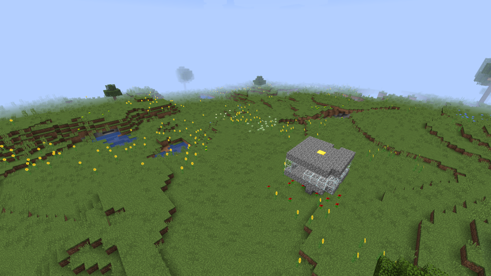

# Past Projects
## Pillager Towers {#pillager-towers}

This was undertaken as a final project for AP Java, in which [Aidan](https://github.com/kelvinnkat) and I created a Forge Minecraft mod in which abandon structures were randomly generated in the world.

This project proved difficult as we had to take out limited syntax knowledge and expand it to true coding capabilities on our own.

---

## Garage prints website